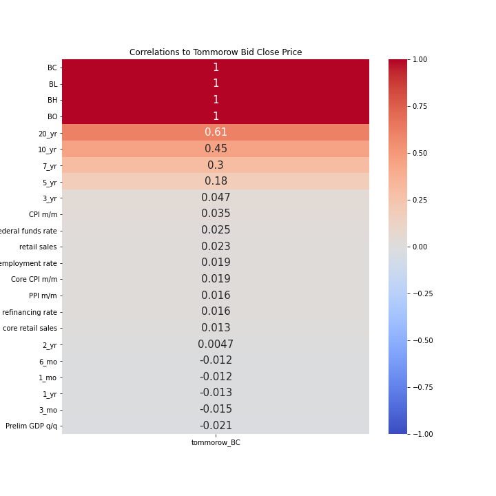

# EUR/USD Time Series Analysis ML Model

## Problem Statement:

To gain a better understanding of the Forex market (specifically the EUR/USD currency), I am investigating trends and possible patterns over the last 17 years. I will then take these findings into creating predictions on the EUR/USD currency and then see if any insights are gained with using machine learning to creating future predictions.

## Data Gathering

Data is gathered as Technical or Fundamental data. Technical data is looking at only the price info. Fundamental data is gathered by looking at economic indicators present in both EU and the USA. 

### Technical Data:

Initial Forex Technical data was collected from a Kaggle dataset which produced price info on EUR/USD from 5/1/2005-4/29/2020. [EUR/USD Price Data 2005-2020] (https://www.kaggle.com/imetomi/eur-usd-forex-pair-historical-data-2002-2019)

Data past the dates listed above was gathered from WSJ and cover 5/1/2020-12/31/2021. [EUR/USD Price Data 2020-2021] (https://www.wsj.com/market-data/quotes/fx/EURUSD/historical-prices)

### Fundamental Data

Fundamental Data on Daily Treasury Yield Curve Rates [Daily Treasury Yield Curve Rates] (https://www.treasury.gov/resource-center/data-chart-center/interest-rates/pages/TextView.aspx?data=yieldYear&year=2019)

Fundamental Economic Data for Europe and the United States was collected from forexfactory.com [Forex Factory] (https://www.forexfactory.com/)

## Data Cleaning

- Fortunately, most of the data was clean and there were not too many null values
- Since the 2 of the 3 main sources were only given as daily updates (business/non-holiday days only), the technical price data was resampled to business days only. This dropped roughly 3% of the days due to the Forex market being open 24/5, and most the days dropped were holidays. This brough the yearly average of days down to ~250 days worth of data a year.
- Yield curve rates on 2 month and 30 year were dropped due to > 50% of data missing from source. The 2-month constant maturity series began on October 16, 2018, so all date for previous years were null due to the data not existing.

After everything was cleaned and finalized, we had the following data dictionary:

## Data Dictionary

|Feature|Type|Description|
|---|---|---|
|**BO**|*float*|Bid Open|
|**BH**|*float*|Bid High|
|**BL**|*float*|Bid Low|
|**BC**|*float*|Bid Close|
|**1_mo**|*float*|1_mo Daily Treasury Par Yield Curve Rates|
|**3_mo**|*float*|3_mo Daily Treasury Par Yield Curve Rates|
|**6_mo**|*float*|6_mo Daily Treasury Par Yield Curve Rates|
|**1_yr**|*float*|1_yr Daily Treasury Par Yield Curve Rates|
|**2_yr**|*float*|2_yr Daily Treasury Par Yield Curve Rates|
|**3_yr**|*float*|3_yr Daily Treasury Par Yield Curve Rates|
|**5_yr**|*float*|5_yr Daily Treasury Par Yield Curve Rates|
|**7_myr**|*float*|7_yr Daily Treasury Par Yield Curve Rates|
|**10_yr**|*float*|10_yr Daily Treasury Par Yield Curve Rates|
|**20_yr**|*float*|20_yr Daily Treasury Par Yield Curve Rates|
|**federal funds rate**|*int*|Interest rate at which depository institutions lend balances held at the Federal Reserve to other depository institutions overnight; If value was better expected than forecast or unknown, marked as a 1|
|**retail sales**|*int*|Change in the total value of sales at the retail level; If value was better expected than forecast, marked as a 1|
|**core retail sales**|*int*|Change in the total value of sales at the retail level, excluding automobiles; If value was better expected than forecast, marked as a 1|
|**PPI m/m**|*int*|Change in the price of finished goods and services sold by producers; If value was better expected than forecast, marked as a 1|
|**unemployment rate**|*int*|Percentage of the total work force that is unemployed and actively seeking employment during the previous month; If value was better expected than forecast, marked as a 1|
|**main refinancing rate**|*int*|Interest rate on the main refinancing operations that provide the bulk of liquidity to the banking system in Europe; If value was better expected than forecast or unknown, marked as a 1|
|**CPI m/m**|*int*|Change in the price of goods and services purchased by consumers; If value was better expected than forecast, marked as a 1|
|**Core CPI m/m**|*int*|Change in the price of goods and services purchased by consumers, excluding food and energy; If value was better expected than forecast, marked as a 1|
|**Prelim GDP q/q**|*int*|Annualized change in the value of all goods and services produced by the economy; If value was better expected than forecast, marked as a 1|

## EDA

As we look to find trends or other insights before we start modeling, we are going to take look at the Bid Close first. Due to the nature of this market being open 24/5, the Bid Close is almost going to always be equal to the next day Bid Open. This is due to both measurements are taken at the same time (5 pm EST). Although predicting the open would be fine for several investments, it won't help with our analysis on this market today.

Transforming our data into the diff and percent diff, we can see the following result over 15 years:

As we can see, the largest amount of diff and percent change is in areas of higher volatility. The time surrounding the financial crisis in 2008-2009, elections in 2016, and the beginning of the pandemic 2020. Both diff and percent change show how these uncertain times produce more chaos and therefore higher volatility.

Moving on towards correlation, we produced two different heatmaps going over. First, we created a new data frame creating rolling averages from 2 to 30 days and their respective standard deviations:

What we found was surprising, the correlation between all of the rolling averages and deviations did not perform and show any type of connection to the next day bid close price.

To gain better insight, we then turned our eyes towards what we had chosen as our model features and ran the following heatmap:

To no surprise, all the technical data was highly correlated producing high correlation values. Our greatest observation that we have found from this is that the higher timeframe yield curve rates produced the highest correlation to our target. This is an interesting takeaway and something we will look to expand upon for future iterations of our model.

Now that we have a good idea of our features and our target, let's move on to modeling.

## Model

### LSTM Model

For this project, I will be exploring a LSTM (Long Short-Term Memory) Recurrent Neural Network and its effectiveness at predicting the future Bid Close price of the EUR/USD currency.

I chose the LSTM model since it rectifies a huge issue that recurrent neural networks suffer from: short term memory. Using a progression of gates, each with its own RNN, the LSTM will keep, forget, or ignore data points based on a probability model.

LSTM also help solve gradient descent problems. This is a result of repeated weight adjustments as the network trains. With repeated epochs, gradients become larger or smaller and it becomes easier for the network’s gradients to compound in a direction not constructive toward helping the model train. While gradient descent issues are huge downsides of using simpler RNN’s, LSTM helps to mitigate this issue.

To evaluate our model for hyperparameter tuning, the Mean Absolute Percentage Error (MAPE) metric was used. This metric tracks how far off the model prediction was from the actual value and returns the total mean value on all points. MAPE performs better when there are not many extremes in the data and non zeros.

After extensive hyperparameter tuning, the model was able to create predictions on the initial test data time frame below:

The R2 score for the above model was 0.99.

Great length was taken to ensure that the model did not have data leakage and that the model predictions were in fact accurate. Due to myself being paranoid though, I continued with even more test data and gathered data from 5/1/2020 through 12/31/2021. As we tested this model on even more unknown data, it should give us a better understanding of the longevity of this model.

The R2 score for the above model was 0.83.

As we can see, there is a large divergence in the first year between the model prediction and the actual values. Due to there being several unknown factors not in my model and this period being the beginning/first few months of the pandemic, the high volatility has appeared to create a divergence. As things had started to settle down around the new year, the model became better at predicting more accurate values.

One thing to notice that is evident in both models, while they can seem to follow a trend generally well, both test cases suffer from not being able to predict inflection points. This makes sense due to those points being cause for a myriad of reasons, and this model wanting to predict in the same general direction as the data has been moving towards for days/weeks.

For both test time frames, if we produced a simple buy/sell and hold strategy with direction predicted only by the model for the next day, we have interesting results. Both strategies would lose money holding until next day bid close over, but if a risk to reward of 1:2 was established, the results are drastically different. The initial test time frame had an almost breakeven profit, while the second testing data produced significant profit.

## Conclusion

The most interesting thing that was noticed during EDA was that the yield curve rates for higher time frame rates all produced much higher correlations than their respective short term counter parts. As I create future models, this will be something to investigate further, and additional rates and data will be explored.

The LSTM model did a few things very well. As trends continued, it was able to stay within a relative range in the same direction predicting the next day bid close. Due to the model not being able to predict inflection points well, the strategy employed above of buy/sell and holding has several days of losses around these points, but still was able to produce a profit when utilizing risk to reward. Since the model was able to follow the trend for most days, other strategies will be tested, and their effectiveness will be compared.
